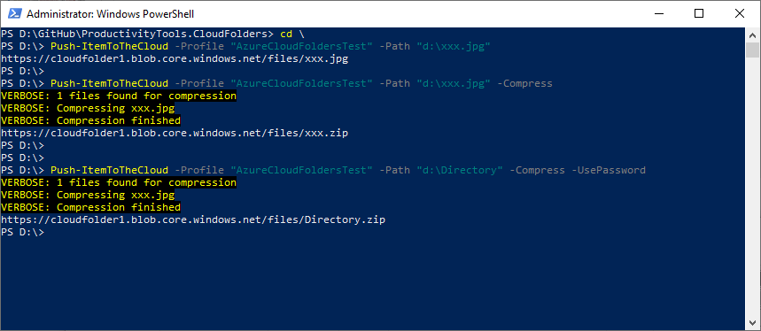
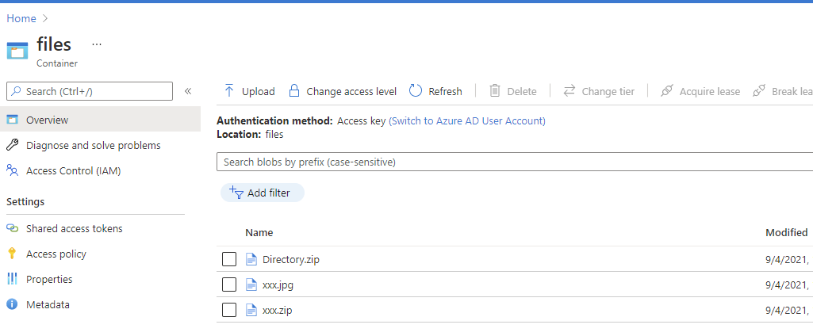

<!--Category:PowerShell--> 
 <p align="right">
    <a href="https://www.powershellgallery.com/packages/ProductivityTools.CloudItems/"></a>
    <a href="http://productivitytools.tech/cloud-blobs/"><a> 
    <a href="https://github.com/pwujczyk/ProductivityTools.CloudBlobs"></a>
</p>
<p align="center">
    <a href="http://http://productivitytools.tech/">
        
    </a>
</p>


# Cloud blobs

Module helps to push files and directories to the azure blob storage.
<!--more-->

I often have a need to send file to someone. I decided to use Azure as exchange platform. Tool of course need to again be convienient to use.

Module is based on the [Master Configuration](https://github.com/pwujczyk/ProductivityTools.MasterConfiguration.Cmdlet) which should contain configuration for the azure blob storage.

To use it in the master configuration file add:

```json
  
"AzureCloudFoldersTest":{
    "Location":"westeurope",
    "ResourceGroup":"cloudfolder1",
    "StorageName":"cloudfolder1",
    "SkuName":"Standard_RAGRS",
    "StorageContainerName":"files",
    "Password":"Test123"
},
```
From this moment you coud use 

```powershell
Push-ItemToTheCloud -Profile "AzureCloudFoldersTest" -Path "d:\xxx.jpg" 
Push-ItemToTheCloud -Profile "AzureCloudFoldersTest" -Path "d:\xxx.jpg" -Compress
Push-ItemToTheCloud -Profile "AzureCloudFoldersTest" -Path "d:\xxx.jpg" -Compress -UsePassword 
Push-ItemToTheCloud -Profile "AzureCloudFoldersTest" -Path "d:\Directory" -Compress 
Push-ItemToTheCloud -Profile "AzureCloudFoldersTest" -Path "d:\Directory" -Compress -UsePassword 
```



Commans will result in:



To see all files on the storage you can use

```powershell
Get-ItemListFromTheCloud -Profile AzureCloudFoldersTest
```


When files are not needed you can remove it one by one or all at once.

```powershell
Remove-ItemFromTheCloud Directory.zip -Profile AzureCloudFoldersTest
Remove-AllItemsFromTheCloud -Profile AzureCloudFoldersTest

```